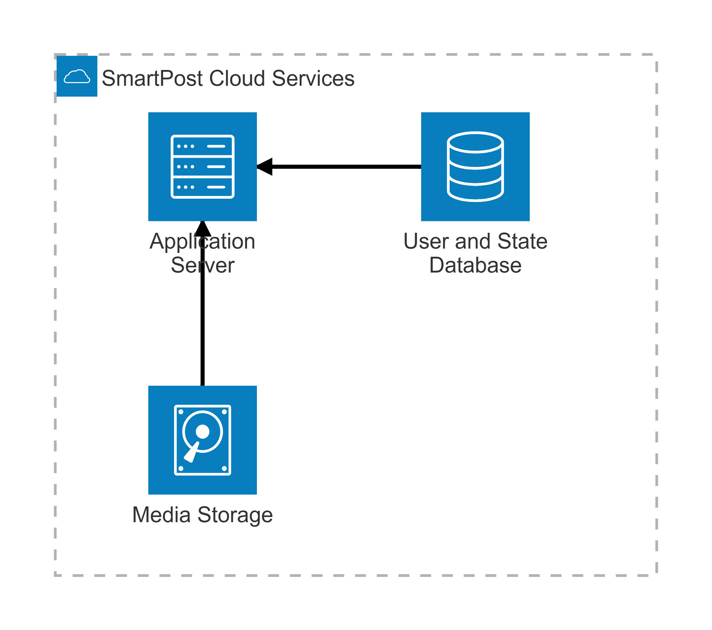
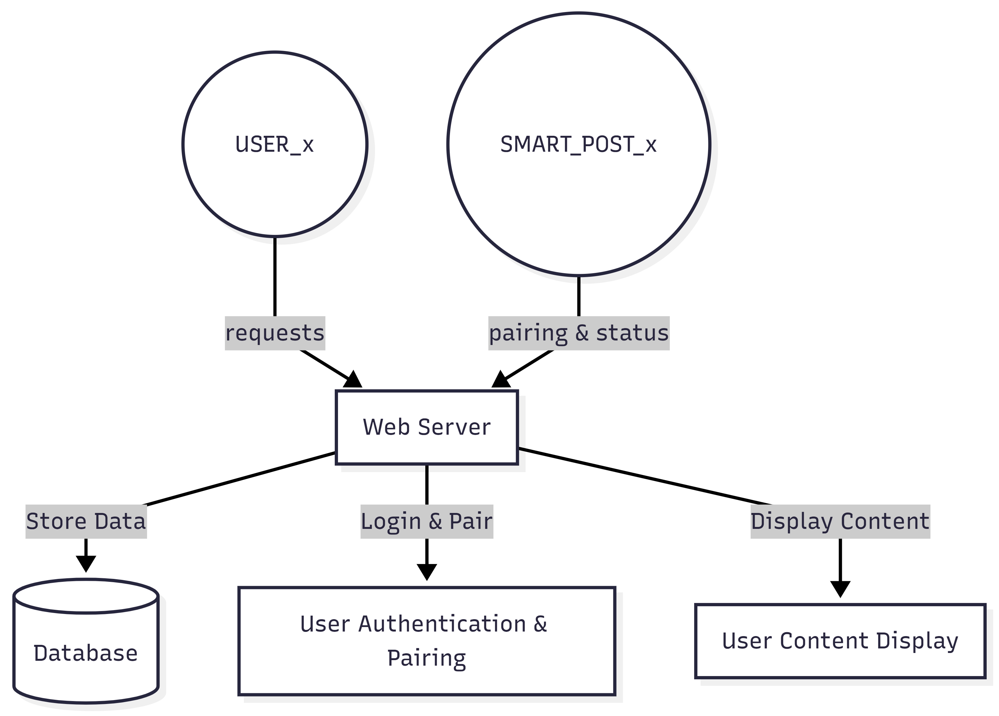
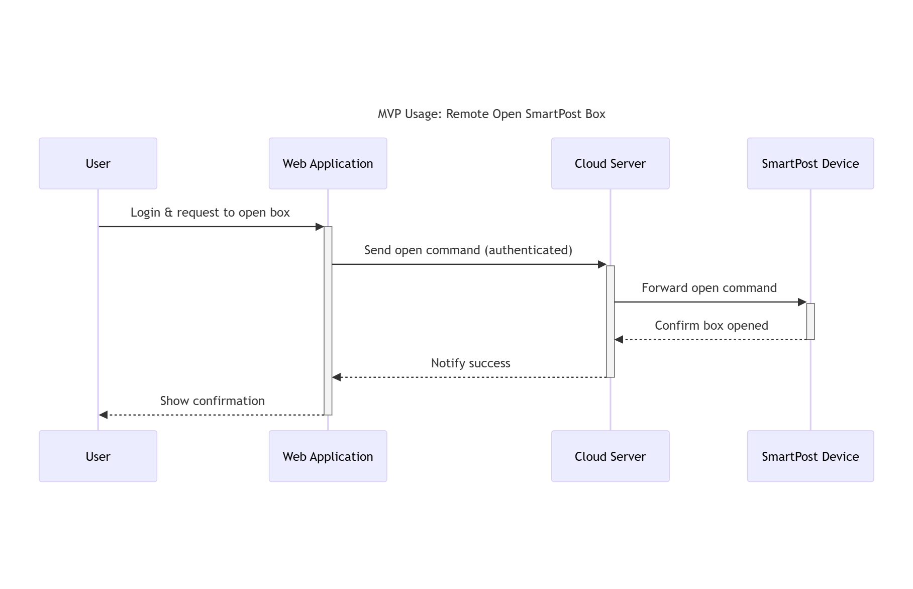
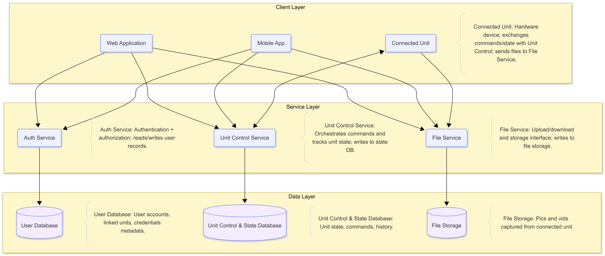

# SmartPost WAN Robot Control

## Architectural Pattern Justification

We use a **Client-Server architecture** with a **Layered (N-Tier) organization**, where the server runs on a **Raspberry Pi** and is exposed to the internet using **Tunnelmole**. The clients (Web App, Mobile App, and the Connected Unit) send requests to the Raspberry Pi server to authenticate users, issue open/close commands, read unit status, and upload/download media.

This fits our project because the Raspberry Pi acts as a single "hub" that is always connected to the physical system and maintains a consistent source of truth for permissions and device state. Tunnelmole provides a practical way to enable secure remote access without managing complex router configuration or requiring a public IP.

### Server Layered Structure

Within the Raspberry Pi server, we use a layered structure:

- **Client Layer:** Handles the UI and user interactions.
- **Service Layer:** Contains business logic split into Auth, Unit Control, and File services.
- **Data Layer:** Stores user records, unit state/command history, and captured files.

This separation improves maintainability and testing: we can change the web/mobile UI without changing control logic, and we can adjust storage (database/filesystem/cloud later) without rewriting the clients.

---

## System Diagrams

*Server-side components: Raspberry Pi server, databases, and storage.*

This architecture supports our MVP epics: enabling users to open/close the SmartPost remotely, stream video or photos, receive package notifications, and review footage from the last 24 hours.

*System boundaries, actors, and data flows.*

The context diagram shows how users and external services interact with the SmartPost system, reinforcing our goal of secure remote access from anywhere.

*Core flow: user remotely opens the SmartPost box.*

This sequence reflects the primary user story: "As a user, I should be able to open/close the SmartPost with internet access from anywhere in order to feel secure and in control."

*Main modules and their interactions.*

The component diagram details how the client layer, service layer, and data layer communicate. We use **Tunnelmole** to connect the Raspberry Pi and control clients, enabling reliable WAN connectivity without complex network configuration.

---

## Trade-Offs

We accept the following trade-offs:

- **Availability / Single Point of Failure:** If the Raspberry Pi is down (power, SD corruption), remote control and streaming stop. Mitigated with good power, backups, and a safe default hardware state (locked/secure).
- **Internet/Tunnel Dependency:** Remote access depends on network and Tunnelmole uptime. Mitigated with timeouts, retries, and clear user feedback when the tunnel is unavailable.
- **Performance Limits:** A Raspberry Pi has less CPU/RAM than cloud hosting, especially for video. Mitigated by limiting resolution/bitrate, using efficient encoding, and keeping services lightweight.
- **Security Surface:** Exposing a Pi to the internet increases risk. Mitigated by enforcing authentication, using least-privilege access, minimizing open ports (tunnel only), and logging/auditing commands.

The benefits—centralized security, maintainability, and extensibility—outweigh these risks for our use case.
