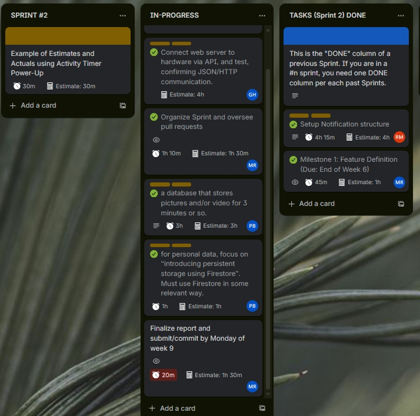
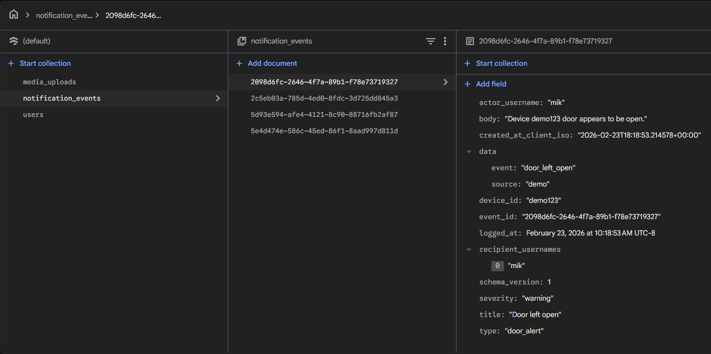

# Sprint 2 Report

This document summarizes our team's progress, deliverables, and lessons learned during Sprint 2 for the SmartPost project.

---

## 1. Sprint Overview

This section provides the team name, sprint dates, and the main goal for Sprint 2.

- **Your Team Name:** SmartPost Team  
- **Sprint 2 Dates:** Tuesday 3 weeks ago until today  
- **Sprint Goal:** Store user data on cloud with Firestore. And try to connect to a version of our server app on a raspberry pi remotely.

---

## 2. Sprint Board

This section lists our team's project management resources and visualizes task ownership and progress for Sprint 2.

**Sprint Board Link:** https://trello.com/b/yflbxHFP/comp7855202610-team1  
**GitHub Repository Link:** https://github.com/CabbageFootKerman/7855_202530_01

---

### 2.1 Sprint Board Screenshot (Filtered by Team Member)

Sprint board screenshots below show each member's contributions and completed tasks for Sprint 2.

- CodeNube737 (Mikhail R)
- CabbageFootKerman (Pawel B)
- Raevz (Ryan M)
- HealyElectrical (Glen Healy)
- **Members Board Screenshot:**
  

---

### 2.2 Completed vs. Not Completed (Feature-Focused)

Based on what you **plan** vs. what you **demoed**, summarize the state of your feature.

**Completed in Sprint 2 (Feature)**

- [x] **Client** can trigger the feature and send input (e.g., POST `/feature`)
- [x] **Server** exposes the endpoint with basic validation
- [x] **Firestore** integration: data is written to the database
- [x] **Server** can retrieve the stored data (GET from Firestore)
- [x] **Basic Testing**: at least one test covering the happy path (or a validation test)
- [x] **Security/Secrets**: credentials are not committed; `.gitignore` excludes sensitive files (e.g., `serviceAccountKey.json`, `.env`)

**Not Completed / Partially Completed**

- None. All planned features were completed.

---

## 3. Technical Summary: Implementation Details

This section describes the main technical deliverables for Sprint 2, focusing on Firestore cloud storage, REST API protocol, and the notification system scaffold for SmartPost.

- **Feature:** Firestore cloud storage & Notification System Scaffold (SmartPost)
- **Collection:** `notification_events` (global event log), `users/{username}/notifications` (per-user inbox)
- **What it does:** Enables persistent storage of device events and notifications in Firestore, with a RESTful API for client-server communication. The notification system (developed by Ryan) supports per-user inboxes, read/unread state, and is designed for future extension to web/mobile push delivery. The main updates in Sprint 2 were to Firestore storage and the REST API protocol, enabling reliable notification delivery and standardized data exchange.
- **Image Uploads:** Server protocols were added (by Pawel) to allow uploading images to a local, GITIGNOREd 'uploads' folder. This scaffolding prepares for future SmartPost image capture uploads.
- **Networking:** Glen integrated external Cloudflare networking, enabling remote connection to our server app. This makes authentication a top priority for the next sprint.

### Data Model (Firestore)

- **Document shape:**
  Example JSON representing a notification document:

  ```json
  {
    "event_id": "auto-generated-id",
    "userId": "firebase-uid",
    "type": "device_event",
    "title": "Device Command Executed",
    "body": "Command sent to device successfully.",
    "status": "unread",
    "createdAt": "2026-03-02T12:00:00.000Z",
    "device_id": "device-123",
    "actor_username": "user@example.com"
  }
  ```

  

  **Why this structure?** This schema enforces per-user ownership, unique identification, and reliable ordering. It supports scalable, secure, and user-specific notification delivery for SmartPost.

- **Input (Client → Server):**  
  Example JSON the client sends (e.g., POST to `/api/device/demo123/command`):

  ```json
  {
    "command": "open"
  }
  ```

- **Output (Server → Client):**  
  Example response the client receives after a successful command:

  ```json
  {
    "message": "Command 'open' received for demo123.",
    "notification": {
      "status": "ok",
      "event_id": "auto-generated-id",
      "recipient_count": 1,
      "deliveries": [
        {"channel": "firestore_event_log", "status": "ok", "logged_event_id": "auto-generated-id"},
        {"channel": "firestore_user_inbox", "status": "ok", "writes": 1},
        {"channel": "web_push_stub", "status": "skipped", "reason": "stub_not_implemented", "recipient_count": 1},
        {"channel": "mobile_push_stub", "status": "skipped", "reason": "stub_not_implemented", "recipient_count": 1}
      ]
    }
  }
  ```

---

## 4. End-to-End Flow

This section outlines the complete workflow for device commands and notifications in SmartPost, from client request to Firestore storage and client retrieval. The notification system was developed by Ryan, image upload scaffolding by Pawel, and Glen enabled remote server access via Cloudflare networking. As a result, adding authentication is a critical next step for security.

1. The client sends a device command to the server via a REST API endpoint.
2. The server authenticates the user, validates the request, and processes the command.
3. A notification is generated and stored in Firestore, both in a global event log and in the user's inbox.
4. The server responds to the client with confirmation and notification delivery details.
5. Clients can retrieve notifications using API endpoints, with support for unread filtering and pagination.
6. The server supports image uploads to a local, GITIGNOREd 'uploads' folder, preparing for future SmartPost image capture features.
7. Remote server access is enabled via Cloudflare networking, making authentication a top priority for the next sprint.

**Bounded Read:**

Firestore queries use `.limit()` and `.order_by()` to efficiently fetch a set number of items per request, ensuring scalable performance and cost control as data grows.

---

## 5. Sprint Retrospective: What We Learned

### 5.1 What Went Well

- We achieved reliable end-to-end persistence and notification delivery using Firestore.
- Our REST API endpoints worked smoothly and were easy to test and demo.
- Team members collaborated well, sharing code reviews and troubleshooting together.

### 5.2 What Didn’t Go Well

- Initial setup of Firebase credentials and permissions took longer than expected.
- Some edge cases in notification delivery and error handling were only discovered late in the sprint.
- We could have made better use of user stories and epics to guide our task selection and prioritization.

### 5.3 Key Takeaways & Sprint 3 Actions

| Issue / Challenge | What We Learned | Action for Sprint 3 |
|---|---|---|
| Firebase setup delays | Credential management is critical and should be planned early | Document setup steps and automate environment checks |
| Late edge case discovery | Early testing helps catch issues sooner | Expand test coverage and add integration tests |
| Task planning | User stories and epics help clarify priorities | Use stories/epics to drive sprint planning and reviews |

---

## 6. Sprint 3 Preview

Based on what we accomplished (and what we didn’t), here are the **next Sprint 3 priorities**:

- **Set up Raspi Tunnelmole:** Build hardware and establish a secure tunnel to connect our Raspberry Pi to the internet.
- **Deploy server online:** Get our SmartPost server running and accessible from the web.
- **Build & test SmartPost API:** Develop and test a robust API for SmartPost clients to interact with the server.
- **Connect Glen's box:** Integrate Glen's home device with the server for real-world testing and feedback.
- **Sprint planning:** Meet as a team to finalize user stories, epics, and priorities for Sprint 3.
