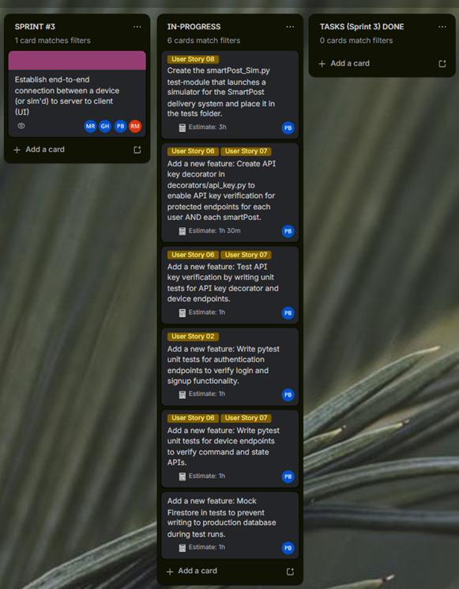
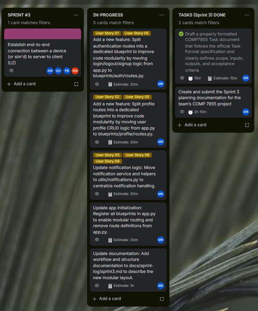
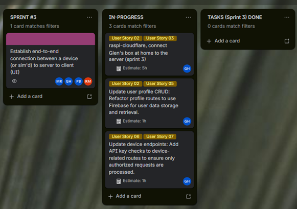
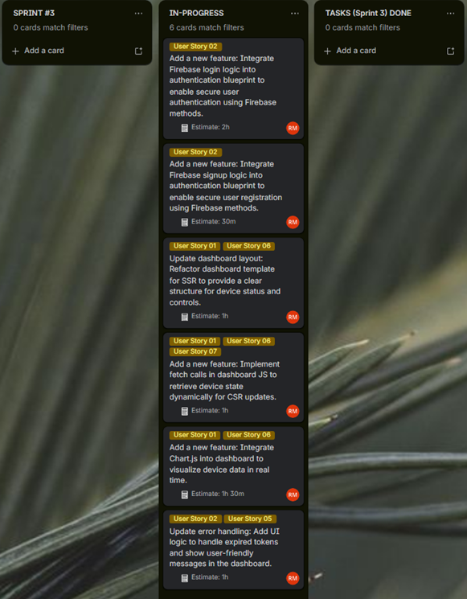

# Sprint 3 Report

- **Team Name:** SmartPost WAN Robot Control  
- **Sprint Dates:** Tuesday, March 3rd – Tuesday March 24, 2026    
- **Sprint Board Link:** [[Link]](https://trello.com/b/yflbxHFP/comp7855202610-team1)  
- **GitHub Repository Link:** [[Link]](https://github.com/CabbageFootKerman/7855_202530_01)

## 1. Sprint Board Screenshots

*Provide screenshots of your Sprint 3 board filtered by each team member.*

**Team Members:**
1. Pawel Banasik
2. Mikhail Rego
3. Glen Healy
4. Ryan McKay

**Pawel Banasik:**


**Mikhail Rego:**


**Glen Healy:**


**Ryan McKay:**


## 2. Sprint Review (Planned vs. Delivered)

*Review what you planned to accomplish this sprint versus what was actually completed. Focus on your architecture, testing, and UI goals.*

**Successfully Delivered:**

- [Blueprint Modularization](Architecture): Modularized the Flask app using blueprints for each feature (auth, dashboard, device, media, profile, notifications, api). `app.py` now only handles initialization, config, and blueprint registration.
- [Firestore Integration](Backend): Set up Firestore integration and device provisioning scripts (`seed_device.py`, `firebase.py`). Device state and command APIs implemented, including dummy device simulation (`dummy_box.py`).
- [Frontend CSR Updates](UI): Added `fetch` calls in dashboard JS for dynamic device state updates. Integrated Chart.js for close-event tracking. Updated dashboard layout and removed demo buttons.
- [Auth & Signup Testing](Testing): Implemented Firebase login authentication and signup validation. Parametrized `pytest` tests added for auth (`test_auth.py`) covering login, signup, and error cases with mocked `verify_id_token`.
- [Device Endpoint Tests](Testing): Added `test_device.py` covering API key validation, telemetry payload validation, session auth, and command queue tests. Fixed test isolation issue in command queue test.
- [Profile Endpoint Tests](Testing): Added `test_profile.py` covering full CRUD (create, read, update, delete) for profile endpoint with Firestore mocked via `unittest.mock`.
- [Error Handling](Backend): Added friendly error handling for expired auth tokens (Ryan McKay). Added GitHub Actions CI workflow for automated test runs.
- [conftest Improvements](Testing): Added sensor key test values to `conftest.py` for test isolation; `autouse` fixture ensures `SENSOR_API_KEY` is always set.

**Not Completed / Partially Completed:**

- **Full test coverage for all endpoints:** pytest is set up and several endpoints are covered, but some blueprints (e.g., notifications, media) still lack tests. Prioritized writing thorough tests for auth, device, and profile over rushing incomplete tests for all endpoints.
- **Real device integration:** `dummy_box.py` is a working simulation placeholder, but still needs to be connected to the live API and validated against the physical device. Device JS (`device.js`) has been updated to restore open/close, photo, and weight data functionality, but full end-to-end hardware testing is pending.
- **Mobile push notification delivery:** Notification system scaffold is present with persistent storage and demo endpoints, but delivery via push notification channels is not yet implemented. Awaiting further research on delivery channels and team availability.

## 3. Architecture & UI Strategy

**Code Modularization:**  
The `src/` folder uses a blueprint-based modular architecture. Each feature (auth, dashboard, device, media, profile, notifications, api) is separated into its own subfolder under `src/blueprints/`. `app.py` acts as the central entry point — it only handles initialization, config loading, and blueprint registration. Utility functions live in `src/utils/`, route guards in `src/decorators/`, and all Jinja2 templates and static assets are separated for clarity and maintainability.

**SSR + CSR Breakdown:**

- **Server-Side (Flask):** Renders base templates and initial page layouts, handles authentication (login/signup), device pages, profile pages, and notification inbox. Provides initial data to pages via Jinja2 template rendering.
- **Client-Side (JS):** Handles dynamic updates — fetching device state, updating UI elements in real time, managing live interactions (e.g., open/close SmartPost box, displaying weight/photo data, updating notifications). Chart.js is used client-side to visualize close-event history.

## 4. Automated Testing & Coverage

- **Testing Framework:** `pytest`
- **Current Code Coverage:** Partial — auth, device, and profile endpoints covered. Full coverage report to be completed.
- **Mocked Components:** `firebase_admin.auth.verify_id_token`, Firestore (`db` via `unittest.mock.MagicMock`), `SENSOR_API_KEY` / `SMARTPOST_PI_API_KEY` env vars, `http_requests.post` (for signup Firebase REST call)

**Test Highlight:**

```python
# test_auth.py — Demonstrates AAA pattern, Mocking, and Parametrization

@pytest.mark.parametrize(
    "payload, expected_error",
    [
        (
            {"email": "", "password": "abcdef", "confirm_password": "abcdef"},
            "Email is required",
        ),
        (
            {"email": "not-an-email", "password": "abcdef", "confirm_password": "abcdef"},
            "Invalid email",
        ),
        (
            {"email": "user@example.com", "password": "", "confirm_password": ""},
            "Password is required",
        ),
        (
            {"email": "user@example.com", "password": "123", "confirm_password": "123"},
            "Password must be at least 6 characters",
        ),
        (
            {"email": "user@example.com", "password": "abcdef", "confirm_password": "abcxyz"},
            "Passwords do not match",
        ),
    ],
)
def test_signup_invalid_input_returns_400(client, payload, expected_error):
    # Arrange — payload and expected_error provided via @parametrize

    # Act
    response = client.post("/signup", json=payload)

    # Assert
    assert response.status_code == 400
    assert response.get_json() == {"error": expected_error}
```
